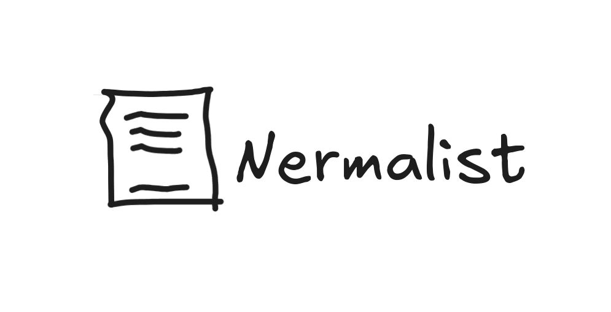

## nermalist

don't let the big brother stalk you 

nermalist: a basic encryption based notes app written in tauri and svelte (mainly dependent on zstd + aes 256 in core logic)

### Demo For Nerds 
https://github.com/user-attachments/assets/5d188e8c-948d-4bca-9cce-f2062c18ee06

---
## License

---
## Contributors

 

---
